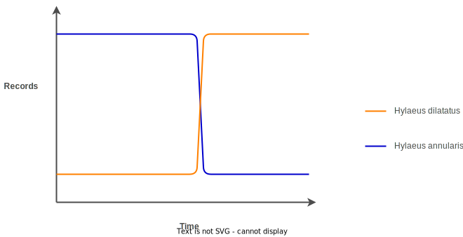

# Nomenclatural Divergence
Nomenclatural divergence is a term for what happens when the type concept and type name diverge in use from one another. In a nomenclatural divergence, there exists data under a type's name which no longer obeys the type concept. This mismatch leads to many varieties of problems in any downstream applications of that name, such as Red Lists, genetic libraries, scientific papers etc. Nomenclatural divergence is the source of one of the largest wastes of a user's time when dealing with scientific nomenclature: checking that all the nomenclature in a given sample/study are modern and trustworthy.

In one example situation, the names *Hylaeus annularis* and *Hylaeus dilatatus* were swapped during the period of study. The two species are very distinct in the number of records in the study dataset. What was originally called *Hylaeus dilatatus* had 36 records, whilst what was originally called *Hylaeus annularis* had 1,579.  Accordingly, the swap led to the researchers 'uncovering' a vast and sudden increase in *H. dilatatus* (36 -> 1,579), with an accompanying catastrophic crash in *H. annularis* (1,579 -> 36).

The result was, of course, false. The change in records was being driven entirely by the *nomenclatural divergence* in the data, as opposed to any true change in the number of records. The fault was explained when the researchers reached out to taxon experts for their assistance in interpretation. Having been made aware of this change during publication - and having dissented the validity of a 'straight swap' of nomenclature - the taxon expert was able to explain what had happened. Without the specialist knowledge provided by the taxon experts, there was no indicator to the researchers that any change had taken place. Even if the researchers *somehow* knew that a change had taken place, they would then have to piece together the (typically disconnected) trail of evidence that led to the nomenclatural divergence.

## Are nomenclatural divergences the result of poor taxonomy
Nomenclatural divergences are specifically not the result of poor taxonomic practices, at least as far as the 2025 editions of the respective taxonomic codes are defined. Whilst the above example is, very arguably, a significant mistake in the application of the zoological code, the vast majority of nomenclatural divergences are caused 'routine' activity. The following sections will cover one such case in *Bombus lucorum*, which has been extensively examined over many years.

## Solving Nomenclatural Divergence
Nomenclatural Divergence is, at its base level, caused by a failure to implement version control in a suitable manner. Linnaean nomenclature, governed by the codes, states that there may only be one valid use of a name at one time. For example, it would be forbidden to declare a new genus *Bombus* as a child of *Apidae*, given that one already exists. However, the codes and their accompanying systems do not have a provision to manage multiple instances of the same name, even if only one of them exists at a time.

The above example using *Hylaeus* was deemed valid according to the codes. The names never repeated themselves - there was one *H. annularis* and one *H. dilatatus*, and then there was one *H. dilatatus* and one *H. annularis*.

|Before|After|
|---|---|
|*Hylaeus annularis*|*Hylaeus annularis*|
|*Hylaeus dilatatus*|*Hylaeus dilatatus*|

Despite this apparent - and code compliant - continuity, there has been a nomenclatural disjunction. What was called *Hylaeus annularis* is now called *Hylaeus dilatatus*, and vice-versa.

|Before|After|
|---|---|
|*Hylaeus annularis*|*Hylaeus dilatatus*|
|*Hylaeus dilatatus*|*Hylaeus annularis*|

This leads to all sorts of interesting results, such as the above mentioned occurrence pattern. The reason is that although the *unique identifier* - in this case the name - has not been changed, the *idea* that the unique identifier represents *has* been changed.

Such an error is well recognised in system architecture. In the Linnaean taxonomic system, the *type name* is acting as the primary point of reference to the *type concept*. When we use the type name (e.g. *Bombus*), we are referring to grouping of organisms defined by the type concept. In architect terms, the type name is the *primary key* to the type concept. A core tenet of the Linnaean taxonomic system is that the system is applied globally and equally. If such a tenet is to hold true, both the name *and type concept* must be immutable - i.e. cannot be changed. By changing the name of *Hylaeus annularis* to *Hylaeus dilatatus*, the primary key - the name - for the type concept has been changed. The system will subsequently deteriorate along predictable patterns, as evidenced by the confusion between the two names and which concept they relate to.

If the name and type concept cannot be changed, the system arrives at a deadlock. Given that it is *necessary* to allow changes to the type concept, a solution is needed to enable modification to happen. The answer is to enable the existence of multiple versions of the type concept:

|Before|After|
|---|---|
|*Hylaeus annularis v1*|*Hylaeus dilatatus v2*|
|*Hylaeus dilatatus v1*|*Hylaeus annularis v2*|

With this format, it is possible to distinguish between the before and after versions of the same name.

## Nomenclatural divergence in a different scope
The above example happened at the taxonomic level - The types themselves had their names swapped, changing their accepted names for everyone at the same time. But what about when a problem occurs in a more limited scope? What do we do then?

To examine this, we will pick the bumblebee *Bombus lucorum*, specifically in the range of the United Kingdom and Ireland. *Bombus lucorum* within this range has been the subject of longstanding uncertainty as to whether there is only *Bombus lucorum*, or whether there are other species present in a cryptic complex. In 2008, a paper was published that laid the matter to rest - *B. lucorum* in the United Kingdom and Ireland was indeed a complex of multiple species.

|Before|After|
|---|---|
|*Bombus lucorum*|*Bombus lucorum*|
||*Bombus cryptarum*|
||*Bombus magnus*|

However, this could not be considered a *taxonomic* change as other regions had already resolved this situation - with differing results per region. This leaves us with a very large problem - there exists data from Great Britain and Ireland recorded as *Bombus lucorum* which does not correspond to the current taxonomic interpretation of the type of *Bombus lucorum*. Once again, we have a *nomenclatural divergence* that needs solving. This time around, we already know the cause of divergence - the meaning of the item has changed whilst the name has remained the same. This means that we can copy the solution from before:

|Before|After|
|---|---|
|*Bombus lucorum v1*|*Bombus lucorum v2*|
||*Bombus cryptarum v1*|
||*Bombus magnus v1*|

Now we know that if we encounter *Bombus lucorum v1* that it represents the aggregate of:

- *Bombus lucorum v2*
- *Bombus cryptarum v1*
- *Bombus magnus v1*

However, this solution presents a problem: the nomenclatural divergence examined here is not global in nature. The only regions which can use this nomenclature are Great Britain and Ireland, as the solution represents a regionally-bounded conclusion.

## And in the worst case scenario
An added complication arises with the second instance of nomenclatural divergence: what is the next version number? If the type of *Bombus lucorum* starts at *v3*, does that make the regional version *v4*?

|Before|After|
|---|---|
|*Bombus lucorum v3*|*Bombus lucorum v4*|
||*Bombus cryptarum v1*|
||*Bombus magnus v1*|

Who maintains the unique list of regional variations in that case, to prevent re-use? If Sweden and Great Britain wish to create their own regional versions in order to maintain accuracy between a name and the concept, who is responsible for allocating the version number, and how does this all work?

|Before|After (GB)|After (Sweden)
|---|---|---|
|*Bombus lucorum v3*|***Bombus lucorum v4***|***Bombus lucorum v4***|
||*Bombus cryptarum v1*|*Bombus cryptarum v2*|
||*Bombus magnus v1*|*Bombus magnus v2*|

What about when a taxonomic change needs to happen? What version does that change stem from if all the options are regional variations? Clearly there is a little more work to do yet.

## Sensu lato and sensu stricto
Traditional taxonomy would solve the issue here very quickly, by the use of *sensu stricto* and *sensu lato*. The pre-change version of *Pipistrelle pipistrellus* would become *Pipistrelle pipistrellus sensu lato*, and the post-change version *Pipistrelle pipistrellus sensu stricto*. However, there are two critical flaws in this approach that render the system unusable.

### Multiple times
It is not guaranteed to only want to adjust a taxon once - indeed, adjusting once is likely an abnormality rather than regularity. For example, the name *Andrena trimmerana* has been used in three specific ways in a period of 10 years. The first change can be managed with *sensu*, giving the following

|Name|
|---|
|*Andrena trimmerana sensu lato*|
|*Andrena trimmerana sensu stricto*|

However, when we want to add the third in, what does this get called?

|Name|
|---|
|*Andrena trimmerana sensu lato*|
|*Andrena trimmerana sensu stricto*|
|*Andrena trimmerana ??*|

In the past, such situations tended to evolve over longer periods of time e.g. 100+ years, which allowed the situation to be solved by 'forgetting' about the first change. With increased attention, dependency, and the advent of genomics, changes occur far faster, more frequently, and have higher potential impact on existing systems. 

### Elephants (and systems) never forget
This table shows how, over long time periods, the use of *sensu* tends to shift between different versions of the type concept.

|Name (early)| Name (late)|
|---|---|
|*Andrena trimmerana sensu lato*|**Forgotten**|
|*Andrena trimmerana sensu stricto*|*Andrena trimmerana sensu lato*|
|**Doesn't exist yet**|*Andrena trimmerana sensu stricto*|

Such a 'forgetful' system is all very well if the only users of such a system are humans with the ability to code-swap between the two time periods. There will be a point of confusion in the switch-over portion, but either side of this switch-over will (theoretically) be stable.

|Early|Switch-over|Late|
|---|---|---|
|Stable|Unstable|Stable

However, there are two critical flaws in this approach. The first is that the switch-over period has been observed to last decades at the very least, with the likely limiting factor being human lifespan. Such a long time period means that instability operates for far longer than is considered acceptable, especially given the ease of solutions.

Secondly, *a good, long-term, system should never forget*. Forgetting is antithetical to the very purpose of a safe, long-term, storage system for data. Accordingly, using 'forgetting' as a method to manage a functional limitation simply will not suffice for the purpose of long term data storage. There is much more to be said about the downstream negative results of 'forgetting' about something, but for the purpose of this document it is enough to say that implementing 'forgetting' as a management system is an unacceptably poor solution.

## Conclusion
Nomenclatural disjunctions within the Linnaean taxonomic system are situations where a taxonomic name and concept diverge from each other. The current Linnaean taxonomic system does not have the means to safely handle nomenclatural disjunction and instead pretends to ignore the problem. As a result of nomenclatural disjunction, users of the Linnaean taxonomic system (including users of taxonomic data) must always be aware of nomenclatural changes in all taxa and regions that their data relate to, so that they might manually resolve the disjunction. Existing design patterns in data handling, specifically versioning, can solve nomenclatural disjunction. However, the specific placement of where and how this versioning should be implemented is not year clear.

[Next page](./layers-in-taxonomy.md)